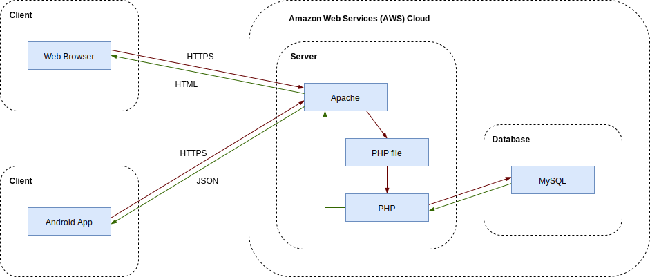
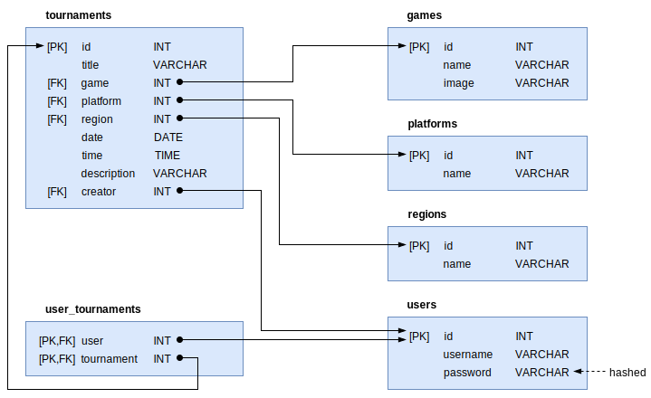

# Website for Organizing Esports Tournaments

The website allows esports enthusiasts to advertise, find, and join virtual tournaments around the world for a variety of games and platforms. Each event specifies the date and time, name of the tournament, name of the game played, platform, region, and number of participants registered so far.

Users do not need to register to browse events. A user can filter events by date/time period (from/to), game played (Call of Duty, Counter-Strike, Fortnite, League of Legends, World of Warcraft), platform (Mobile, PC, PlayStation 4, Switch, Xbox One), and region (Africa, Asia, Europe, North America, Oceania, South America).

To sign up for an event, a user must register first by choosing a username and password. Logged in users can sign up for tournaments and review all events they have registered for on the "My Tournaments" page. Logged in users can also create new tournaments so that other users can sign up for them.

## System Architecture

## Database Design

